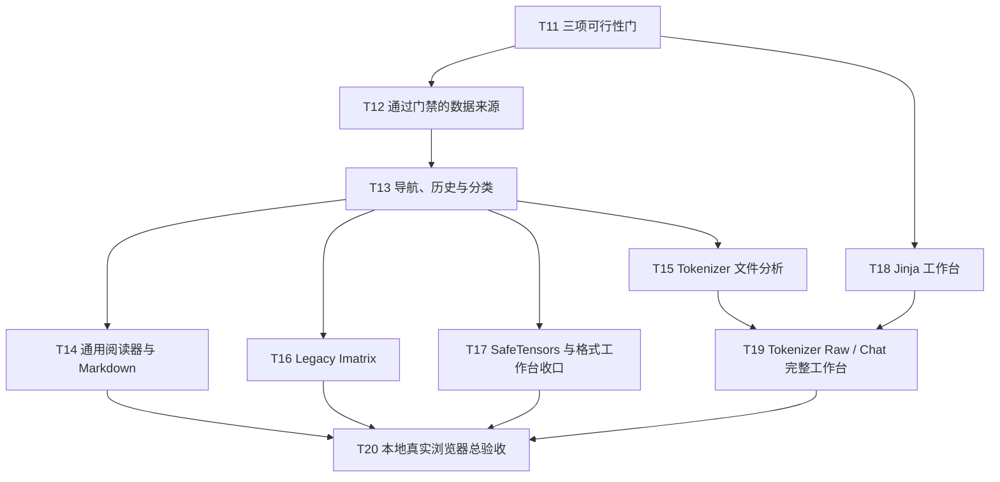

# ModelFiles Web 本地功能完整性计划

状态：T11–T20 本地功能完整性已完成；T21–T38 原生功能追平已完成；功能/运行时/文档验收 `PASS`；发布后置

日期：2026-08-10

更新日期：2026-09-09

历史本地功能基线：`edb0f56c89d7e5f2edcd17f1a4c6eadd7e1532da`；功能/性能提交到 `81b8eb9`；Tensor hierarchy 提交到 `5e08c4a`；六份文档由本文件所在提交收口

当前里程碑：T21–T38 原生功能追平完成（不发布、不打 tag、不要求远端 CI）

历史证据：[v0.1 纵向验收记录](v0.1-acceptance.md)

2026-09-09 增量：保持纯静态网页，增加 HTTPS 文件/JSON 清单加载和对照入口；HTTPS 为会话内 live 来源，不套用 Hugging Face 固定 revision 的承诺。来源合同见 [README](../README.md#https-加载)，ModelScope 复测见 [可行性记录](feasibility-gates.md)。以下 T11–T38 保留为历史阶段计划。

## 1. 结论

Web 版已完成纯浏览器可行范围内的本地功能移植。公开 Hugging Face、本地目录、全部受支持阅读器/检查器、Jinja 与 Tokenizer Raw/Chat 工作台均有真实浏览器证据；ModelScope、SSH、完整 GGUF directory、私有仓库、推理与权重内容保持有证据的 `NO-GO`。

本阶段按以下标准完成：

1. 只实现纯 Web、无后端条件下可成立的功能。
2. 本地启动应用，在真实浏览器中逐条走通所有已声明支持的功能。
3. 暂不发布；Git remote、tag、Pages、线上 smoke 和回滚都不属于当前门禁。
4. 对尚不确定的功能先做纵向可行性门。门失败后记录 `NO-GO` 并从产品入口移除，不维护半成品或兼容假象。

原计划 T1–T10 的结果只作为基础设施证据保留；本计划从 T11 开始安排下一步。

## 2. 本地完成定义

只有同时满足以下条件，才可称为“本地功能完整性完成”：

- 支持矩阵中的每一项都有最终状态：`PASS` 或有证据的 `NO-GO`；不得残留 `GATE`、`FAIL` 或未经验证的“应该可用”。
- 每个 `PASS` 功能至少有一个离线浏览器 E2E；涉及真实 Hub 行为的功能另有真实浏览器 smoke。
- 通用远端功能在 Chromium、Firefox、WebKit 中通过；浏览器能力限定的本地目录功能只在 T11 实测通过的引擎中声明支持，并在其他引擎显示明确不可用状态。
- 应用从 `npm run dev` 启动后，完整验收不依赖后端、浏览器扩展、桌面桥接进程或已发布站点。
- 所有权重边界保持失败关闭：不整文件下载权重，不读取 SafeTensors tensor 数据，不把 GGUF 基础摘要声称为完整目录支持。
- 错误、取消、超限和不支持状态均能在浏览器中恢复；快速切换不会显示旧结果。
- `npm ci`、unit、build、离线 E2E、真实 smoke、`git diff --check` 全部按其适用范围通过。

## 3. 功能盘点与范围决定

最终状态含义：

- `PASS`：已实现并有适用浏览器证据。
- `NO-GO`：当前约束下明确不实现，也不预留抽象。

| 原生能力 / 用户任务 | 当前 Web | 决定 | 说明 |
| --- | --- | --- | --- |
| 公开 Hugging Face 仓库、固定 revision、清单、筛选、深链接 | 已完成 | `PASS` | 匿名、严格来源与取消语义；三浏览器离线和真实 Chromium smoke |
| ModelScope 公共仓库 | 无 | `NO-GO` | 清单接口返回 200 但没有 CORS 响应头，浏览器 fetch 失败；不增加代理或桥接 |
| 用户主动选择本地模型目录 | 已完成 | `PASS` | Chromium、Firefox、WebKit 均通过完整目录路径、相对路径和 `File.slice()` |
| SSH 目录 | 无 | `NO-GO` | 浏览器不能直接提供 SSH；禁止引入代理或桌面桥接 |
| 仓库历史与输入补全 | 已完成 | `PASS` | 最近 10 个远端仓库、大小写去重、可清除；不缓存内容或输入 |
| 文件分类、阅读优先级、路径复制、源站打开、会话内检查结果缓存 | 已完成 | `PASS` | 对齐原生分类；同一 snapshot 成功结果只在会话内缓存 |
| Config、Generation Config、通用 JSON、文本、分片索引阅读器 | 已完成 | `PASS` | 概览 / 全部字段 / 原文；1,000 项渐进展示 |
| Markdown 模型卡渲染 | 已完成 | `PASS` | GFM、三种排版、原文；禁用 raw HTML 与第三方图片请求 |
| `tokenizer.json` 结构与词表分析 | 已完成 | `PASS` | BPE、WordPiece、Unigram 结构与 Unicode 标量统计在 Worker 中完成 |
| `vocab.json`、`merges.txt`、`tokenizer_config.json` 阅读 | 已完成 | `PASS` | 搜索、渐进列表和语义摘要 |
| SafeTensors | 已完成 | `PASS` | 两次精确 Range/File.slice，完整 Header 工作台、层级 tensor 目录与详情，0 bytes tensor 数据 |
| GGUF 基础摘要 | 已完成 | `PASS` | 固定 24 bytes，只显示版本、字节序与计数 |
| GGUF 完整 metadata / tensor directory | parser 已验证，产品门失败 | `NO-GO` | 现有真实证据会越过 tensor data offset 339,552 bytes，不重开此任务 |
| Legacy `imatrix*.dat` | 已完成 | `PASS` | 受限全文解析、概览、搜索与 Entry 详情；其他 `.dat` 不猜测 |
| Jinja 源码与 Chat Template 试验台 | 已完成 | `PASS` | 固定 gold、三浏览器离线、真实 Qwen Chat；禁止 include 和代码执行 |
| Tokenizer Raw 工作台 | 已完成 | `PASS` | 225 ms latest-only、grapheme-safe 片段、完整表格与 10k 渐进显示 |
| Tokenizer Chat 工作台 | 已完成 | `PASS` | 可见渲染字符串逐字等于 `add_special_tokens:false` 的权威编码输入 |
| PyTorch、ONNX 等权重内容 | 锁定 | `NO-GO` | 只展示身份、大小、哈希和锁定原因 |
| 私有仓库、token、账号同步 | 无 | `NO-GO` | 不在浏览器保存访问凭据 |
| 模型推理、转换、量化、修改、上传 | 无 | `NO-GO` | 不是文件检查器职责 |

发布、tag、Pages 与线上回滚不属于产品能力矩阵，继续后置。

## 4. 实施边界

### 4.1 数据与来源

- 继续使用一个 `RepositorySnapshot` 表示当前快照；只有第二个来源通过 T11 后，才增加最小的来源判别联合类型和具体 `switch`。
- 不建立 adapter registry、provider protocol、插件系统或通用虚拟文件系统。
- Hugging Face 内容固定到不可变 revision；ModelScope 未通过门禁、不进入数据层；本地目录是当前用户选择产生的 live snapshot，刷新后要求重新选择。
- 同一快照中只有已完成的检查结果可以做内存缓存；失败、截断前缀和本地目录权限不持久化。
- 历史记录最多保留最近 10 个远端仓库输入，大小写去重，并提供清除。除此之外不使用 localStorage 或 IndexedDB。

### 4.2 读取与执行预算

| 资源 | 上限 | 超限行为 |
| --- | ---: | --- |
| 普通全文 / Markdown / Imatrix | 32 MiB | 读取前按清单或 `File.size` 拒绝，读取后复核 |
| SafeTensors Header | 25,000,000 bytes | 校验长度后拒绝，不请求 Header 或 tensor 数据 |
| GGUF | 24 bytes 产品读取 | 只保留基础摘要；不调用完整目录 parser |
| Tokenizer bundle | 32 MiB | 同目录资源总量和实际读取量双重检查 |
| Tokenizer / Template 输入 | 64 KiB UTF-8 | 提交 Worker 或渲染前拒绝 |
| 单次远端 Range | 精确请求长度 | 必须为 `206`，且 `Content-Range` 和实际长度完全匹配 |
| 本地目录 | 100,000 文件、路径最多 4 KiB UTF-8 | 选择后先验证清单，不创建无界索引 |

模板渲染与 tokenizer 解析必须在 Worker 中完成或经浏览器测量证明主线程不会阻塞。模板不得执行任意 JavaScript、网络 include 或仓库自定义代码。

### 4.3 UI 与状态

- 保留当前三栏工作台和现有 React 状态；不增加 router、全局状态库或组件库。
- URL 继续用 `URLSearchParams`；若 ModelScope 通过门禁，增加明确的 `source` 参数，避免相同 model ID 的来源歧义。
- 文件详情按真实需要提供有限 perspective：普通文件 `概览 / 全部字段 / 原文`，结构格式使用自己的语义视图。
- 只有单个文件已承担两个独立功能片并明显影响测试时才拆分；不预先建立通用 Inspector 框架。
- 新依赖必须对应 T11 已通过的具体能力。Markdown 或 Jinja 若确需依赖，只选择一个完成当前任务的实现并记录 license、bundle 增量和 CSP 影响。

## 5. 依赖顺序



T18 只在 Jinja 为 `GO` 时执行；T19 的 Chat 部分只在 T18 通过时执行。ModelScope 或本地目录门失败不会阻塞其余功能。

## 6. 分阶段任务

### Phase E：先冻结“可行”的边界

#### T11 — ModelScope、本地目录与 Jinja 三项可行性门（M）

**工作：**

- 在真实浏览器中验证 ModelScope：清单 CORS、commit/revision 身份、固定版本内容 URL、全文读取、精确 Range、可见响应头与取消。
- 用小型本地模型目录验证浏览器原生目录选择：相对路径、大小、重复文件名、子目录、`File.slice()` 精确读取、再次选择、取消和 100,000 文件前置上限。默认先试一个原生 `<input type="file" webkitdirectory multiple>`，不同时维护第二套 picker。
- 对 Jinja 候选运行时执行离线兼容矩阵：基础对话、Tools、typed variables、`add_generation_prompt`、Qwen3 模板和一个已知复杂模板。输出必须与固定 gold 逐字一致，错误必须稳定定位。
- 记录每项的浏览器、请求、读取字节、耗时、console 和 `GO / NO-GO`；更新第 3 节矩阵。

**验收：**

- ModelScope 只有在清单和内容读取都能固定 revision、Range 严格失败关闭时才为 `GO`；需要代理、宽松 CORS 或整文件回退即 `NO-GO`。
- 本地目录只有在至少一个目标浏览器中能通过用户手势稳定列出并按 slice 检查文件时才为 `GO`；支持引擎写入产品契约。
- Jinja 只有在不使用 `eval`、不发外部请求且固定模板输出完全一致时才为 `GO`；“大多数看起来能渲染”不算通过。
- 门禁阶段不增加永久产品入口，不引入尚未证明需要的架构层。

**验证：** 独立 browser probe、最小 fixture、结构化 JSON 证据和 `git diff --check`。

**依赖：** 无。

#### Checkpoint E — 支持矩阵冻结

- [x] 三项 `GATE` 均已变为 `GO` 或有证据的 `NO-GO`。
- [x] 最终来源、浏览器和模板兼容边界已写清，没有待猜测入口。
- [x] 完整 GGUF 保持 `NO-GO`，未因功能对齐而放宽权重读取边界。

实际结果见 [T11 纯浏览器可行性门记录](feasibility-gates.md)。后续只接入本地目录来源；ModelScope 不进入产品实现。

### Phase F：补齐来源、导航和只读检查器

#### T12 — 接入通过门禁的数据来源（M，条件任务）

**实际：已完成。** 只接入本地目录；同一 `readWholeFile` / `readExactRange` 分别落到受限 `File.arrayBuffer()` / `File.slice()`。路径、大小、重复、多根与上限失败关闭；三目标浏览器完成选择、读取、Tokenizer Worker、重新选择清状态与零外部上传 E2E。

**工作：**

- 仅为 T11=`GO` 的来源扩展现有快照与读取函数；继续复用分类、全文上限、Range 校验和取消。
- ModelScope 如通过，接受明确 URL 并把解析后的来源写入深链接；不得用 HF URL 读取 ModelScope 快照。
- 本地目录如通过，从用户选择的 `File` 列表建立 live snapshot；全文使用 `arrayBuffer()` 的受限读取，Range 使用 `slice(start, end + 1)`，不上传文件。
- fixture 证明同一检查器可在远端和本地快照上工作，不为每个格式复制读取实现。

**验收：** 来源身份不可混淆；路径穿越、未知/变化大小、超限、取消和短读均失败关闭；切换来源后旧结果不能回写。

**验证：** source unit tests、离线浏览器 E2E、每个 `GO` 来源一次真实浏览器 smoke。

**依赖：** T11。

#### T13 — 导航、历史、分类与会话缓存（M）

**实际：已完成。** 分类与首选顺序已对齐原生 `FileClassifier`；最近 10 条远端输入支持大小写去重与清除；本地来源不写历史或 URL；路径复制、固定 revision 源站链接、会话检查缓存及 WebKit datalist 键盘提交均有三浏览器 E2E。

**工作：**

- 对齐原生 `FileClassifier` 的类别与阅读优先级，覆盖 config、tokenizer、template、weight index、Imatrix、文档和锁定权重。
- 增加最近 10 个远端仓库输入的补全、大小写去重和“清除历史”；不记录本地目录路径或文件内容。
- 增加复制路径、源站固定 revision 链接、清晰的来源/版本状态；本地文件不伪造源站链接。
- 对同一 snapshot 的成功检查结果做会话内缓存；刷新、换来源或本地重新选择后清空。

**验收：** `tokenizer_config.json` 归入 Tokenizer；首选文件与原生顺序一致；筛选零网络；切换回来不重复读取；历史可清除且不包含敏感内容。

**验证：** classifier/history unit tests，前进/后退、刷新、筛选、缓存和历史 E2E。

**依赖：** T12；若 T11 所有新来源均 `NO-GO`，直接依赖 T11。

#### T14 — 通用 JSON、文本、分片索引与 Markdown 阅读器（M）

**实际：已完成。** 六类离线入口、10,005 项 JSON 与 100,002 行文本均使用渐进 DOM；Markdown 使用固定版本的 `react-markdown` / `remark-gfm`，raw HTML 不执行、第三方图片不请求、仓库相对 URL 固定到 revision。三浏览器 E2E 通过。

**工作：**

- 为 `config.json`、`generation_config.json`、`tokenizer_config.json` 和权重分片 index 提供语义概览，同时保留全部字段和严格原文。
- `vocab.json`、`merges.txt` 和大文本支持本地搜索、稳定顺序、每次渐进显示 1,000 项/行；不一次创建十万 DOM 节点。
- Markdown 提供渲染/原文切换和 GitHub / 默认 / 紧凑三种排版，覆盖标题、段落、列表、引用、代码、表格和链接；禁用原始 HTML 执行。
- 仓库相对链接和图片固定到当前 revision；第三方图片默认显示 alt 与可点击链接，不静默扩大 CSP 或泄露访问请求。
- 无效 JSON、UTF-8、链接和超限内容显示可恢复错误，不退回宽松解析。

**验收：** 固定 fixture 的摘要字段、分片计数/总大小、搜索与渐进显示正确；Markdown 不执行脚本、`javascript:` 或任意 HTML；Raw 与渲染内容可核对。

**验证：** parser unit tests，六类文件的离线 E2E，Qwen 真实 config/README smoke，10k/100k 行浏览器流畅性测量。

**依赖：** T13。

#### T15 — `tokenizer.json` 结构与词表分析（M）

**实际：已完成。** 复用同一 Worker 和 bundle 缓存，覆盖 BPE、WordPiece、Unigram、未知/重复/空词表；缺配置时明确 Raw 不支持，不合成配置。结构与 Unicode 标量统计的 unit/Worker E2E 通过。

**工作：**

- 复用当前 tokenizer Worker 和同目录 bundle，不增加第二份 tokenizer 运行时。
- `tokenizer_config.json` 缺失时只有现有运行时能够严格构造才继续；否则明确 `UNSUPPORTED`，不合成虚假配置或切换宽松模式。
- 展示根字段摘要、格式版本、model type、词表/merge/added token 计数。
- 对 BPE、WordPiece 和 Unigram 可识别词表计算 Unicode 标量长度分布、平均值、P50/P90/P95/P99、最大值与稳定排序的 Top 50 最长 token；Added Token 单列，不混入基础词表分布。
- 分析在 Worker 中完成，保留 32 MiB bundle 和 64 KiB 输入边界；不展开整个对象到 DOM。

**验收：** 三类离线 fixture 与原生既有 gold 一致；重复 ID、空/未知 vocab 和不支持结构明确显示“不可分析”，不伪造结果；大 Qwen tokenizer 不阻塞输入与文件切换。

**验证：** tokenizer inspection unit tests、Worker E2E、Qwen 真实浏览器性能记录。

**依赖：** T13。

#### T16 — Legacy Imatrix 检查器（M）

**实际：已完成。** little-endian parser 与全部上限失败关闭；已知两条 entry、chunk、dataset、搜索和详情在远端 fixture 与三浏览器完整本地目录中通过。

**工作：**

- 只识别文件名含 `imatrix` 且为 `.dat` / `.dat.at_*` 的文件；其他 `.dat` 保持普通/锁定状态。
- 按 little-endian 格式解析 entry name、call count、value count 和 float values，只保留 min/max/mean；支持可选 chunk count 与 dataset trailer。
- 强制 32 MiB 文件、100,000 entries、1,024-byte 名称和 10,000,000 累计 float 上限，并拒绝重复名称、截断、无效 UTF-8 与非有限 float。
- UI 提供概览、Entries 搜索和选中项详情。

**验收：** 已知 fixture 的两条 entry、统计值、chunk 和 dataset 与原生 gold 一致；解析仅读取所选 Imatrix 文件，不读取任何权重。

**验证：** parser unit tests、恶意/截断 fixture、远端 fixture 与本地目录（若 `GO`）真实浏览器 E2E。

**依赖：** T13。

#### T17 — SafeTensors 与格式工作台收口（M）

**实际：已完成。** SafeTensors 的 Overview / Metadata / Tensors、105+ tensor 搜索与渐进展示、选中详情和缓存通过；仍只读两段 Header。GGUF 保持固定 24 bytes 基础摘要。

**工作：**

- SafeTensors 补齐概览 / Metadata / Tensors，支持 key/value/name/dtype 搜索、渐进结果、选中行详情和完整 shape/offset/bytes 信息。
- 保持 Header 两次精确 Range 和 `0 bytes` tensor 数据断言；切换 perspective 不重复请求。
- GGUF 继续只显示基础摘要和显眼的支持等级说明，不暴露未接入的完整 parser UI。
- 统一各格式的加载动作、错误阶段、重试、取消、空结果和安全读取说明；只统一已有重复交互，不建立格式插件层。

**验收：** 超过 100 个 tensor 时可继续搜索/浏览，不再静默截断为前 100；所有展示事实标明内嵌/推导/运行来源；错误保持在当前文件详情内。

**验证：** SafeTensors unit/E2E、105+ tensor fixture、Qwen 真实网络读取账本、快速切换与 perspective E2E。

**依赖：** T13。

#### Checkpoint F — 只读检查器完整

- [x] 每个支持类别至少有一个真实文件入口和一个浏览器 E2E。
- [x] Config、文本、Markdown、Tokenizer 结构、SafeTensors、Imatrix 与 GGUF 基础摘要均符合其支持等级。
- [x] 锁定权重、超限与格式错误无全文或宽松解析回退。

### Phase G：补齐交互试验台

#### T18 — Jinja 源码与 Template Playground（M，条件任务）

**实际：已完成。** 独立模板优先、嵌入模板回退、源码临时编辑/恢复、三种 preset、Tools、typed variables、结构/原始输出、复制和稳定错误均在共享 Worker 路径中通过；include 明确拒绝。

**工作：**

- 仅在 T11 Jinja=`GO` 时接入同目录 `chat_template.jinja` 和 `tokenizer_config.json.chat_template`，优先级固定为独立文件优先。
- 提供概览 / 源码 / 试验台；源码临时编辑、恢复来源、行数/字节数/修改状态和可读的 Jinja 高亮不写回仓库。
- 试验台支持 messages、role/content、Tools、typed variables、`add_generation_prompt`、基础/工具/多模态 preset、结构索引 / 原始输出切换、选中项详情、复制输出与渲染错误。
- 渲染在 Worker 中 latest-only；选择文件或模板变化后旧输出不能回写。模板不能 include 网络资源或执行任意代码。

**验收：** 固定模板输出逐字等于 gold；工具 JSON 与 typed variables 正确；模板错误清空旧输出；源码/试验台切换保留当前临时编辑，切换文件后丢弃。

**验证：** renderer unit tests、Jinja 工作台 E2E、Qwen Chat 真实浏览器 smoke、已知不支持模板的明确 UNSUPPORTED 证据。

**依赖：** T11 Jinja=`GO`、T13。

#### T19 — Tokenizer Raw / Chat 完整工作台（M）

**实际：已完成。** Raw 与 Chat 共用同一结果和 Worker；大于 2,000 token 的 decoded 映射保留为一个权威 grapheme-safe 组，避免逐 token decode，逐 token 表仍保留全部 ID/piece 并按 1,000 行渐进。Chromium 10k token 从修前 40.4 秒超时降到 1.2–1.3 秒；三浏览器功能路径通过，Qwen Exact 与 T5 Decoded-only 真实 smoke 通过。

**工作：**

- Raw 保留当前真实 tokenizer Worker，改为 225 ms latest-only；空输入立即返回 0 token，超限不启动 Worker。
- 补齐权威输入预览、输入复制/清空、token 数、bytes/token、ID 复制、空白符切换、彩色 grapheme-safe 片段、片段 ID 和 `# / ID / Token Piece / Decoded / Mapping` 表。
- 片段、ID 与表格共享同一个 `TokenizationResult` 和选中 token，hover/选择可互相定位，切换不重新 encode；10k token 使用渐进/虚拟化展示。
- Jinja=`GO` 时增加 Raw / Chat：可见渲染字符串是唯一权威输入，再以 `add_special_tokens:false` 编码；渲染失败不执行 tokenizer。
- 无模板或模板不支持时保留 Raw，并明确说明 Chat 不可用原因；不猜测 tokenizer 类型或模板语义。

**验收：** ASCII、中文、连续空白、组合字符、重复/ZWJ emoji、byte fallback、unknown 和 normalization 全部不丢 ID；Exact 与 Decoded only 不混淆；Chat 预览逐字等于实际编码输入且不重复 BOS/EOS。

**验证：** 扩展现有 tokenizer unit tests，增加 Raw/Chat/取消 E2E、Qwen Exact 与 T5 Decoded-only 真实浏览器 smoke、10k token encode 次数与滚动测量。

**依赖：** T15；Chat 部分另依赖 T18。

#### Checkpoint G — 交互分析完整

- [x] Tokenizer Raw 的结构分析、片段和 Token 表共用一份结果。
- [x] Jinja=`GO` 时，独立模板与 Tokenizer Chat 都通过同一权威渲染路径。
- [x] 输入、模板、文件和仓库快速变化时，旧 Worker 结果永不覆盖当前状态。

### Phase H：只做本地浏览器验收

#### T20 — 全功能本地真实浏览器验收（M）

**实际：已完成。** 最终环境、命令、浏览器版本、真实 revision、请求字节、耗时、console 与截图路径见 [本地功能完整性验收记录](local-functionality-acceptance.md)。离线门禁 43 pass / 11 条按设计 skip，真实 Chromium 3 pass；不依赖发布或后端。

**自动门禁：**

```bash
cd tools/model-files-web
npm ci
npm run check
npm run test:e2e
npm run test:e2e:live
git diff --check
```

**浏览器矩阵：**

- Chromium、Firefox、WebKit：Hugging Face、文件分类/筛选、历史、深链接、Config、Markdown、SafeTensors、GGUF 基础、Imatrix、Tokenizer Raw、错误恢复、取消、浅/深色和三个目标视口。
- Jinja=`GO`：三浏览器离线工作台；Qwen Chat 至少在 Chromium 真实网络通过，其余引擎无兼容分叉。
- ModelScope=`GO`：三个目标引擎分别验证清单与至少一个内容文件；任何引擎差异写入支持合同。
- 本地目录=`GO`：T11 支持引擎使用一个包含 config、README、vocab、merges、weight index、Imatrix、Jinja/tokenizer fixture 的目录完成选择到检查的整条路径。

**真实数据集：**

| 目标 | 必验路径 |
| --- | --- |
| `Qwen/Qwen3-0.6B` | config、README、SafeTensors、tokenizer 结构、Raw；Jinja=`GO` 时增加 Chat |
| `google-t5/t5-small` | Raw Tokenizer 的 `Decoded only` |
| `bartowski/Qwen_Qwen3-0.6B-GGUF` | 24-byte GGUF 基础摘要、0 bytes 模型数据 |
| 离线综合目录 fixture | 所有通用阅读器、分片 index、Imatrix、模板错误、超限与本地来源（若 `GO`） |
| ModelScope 真实仓库 | 仅在来源=`GO` 时执行固定 revision 与 Range smoke |

**最终证据：**

- 更新一份本地验收记录，逐项写 `PASS / NO-GO`、浏览器版本、命令、请求字节、耗时、console、截图绝对路径和真实仓库 revision。
- 浏览器 console 0 error / 0 warning；请求账本证明 SafeTensors tensor 与 GGUF 模型数据均为 0 bytes，Tokenizer/Jinja 只读取同目录资源。
- 390×844、768×1024、1280×800 的主操作无遮挡；键盘可完成打开、筛选、选文件、切 perspective、编辑、运行、查看表格与重试。
- 验收结束时第 3 节不存在 `GATE`，所有已声明能力均为 `PASS`；任一已声明功能失败则里程碑整体为 `FAIL`，不以发布工作流状态代替功能结果。

**依赖：** T14、T16、T17、T19；条件功能依赖各自 `GO` 任务。

#### Checkpoint H — 本地功能完整性门

- [x] `npm run dev` 入口在 Chromium 启动且 console 干净；同源 production build 在三个目标引擎通过全部适用路径。
- [x] 支持矩阵中所有能力均有浏览器证据；不可行能力均有可复核 `NO-GO`，且产品 UI 不暗示支持。
- [x] 安全读取、取消、性能、可访问性和响应式没有从纵向基线回退。
- [x] README、支持矩阵和本地验收记录与实际 UI 一致。
- [x] 无部署、tag、production URL 或回滚依赖。

## 7. 风险与停止条件

| 风险 | 处理 / 停止条件 |
| --- | --- |
| ModelScope 浏览器 CORS 或 Range 不完整 | T11 直接 `NO-GO`；不加代理、不放宽 Range |
| 目录选择只在部分浏览器可用 | 只声明实测通过的引擎；其他引擎显示能力不可用，不维护两套目录 API |
| Jinja 运行时兼容不足或依赖过重 | 固定 gold 不一致、需要 `eval`、远端 include 或明显破坏交互预算即 `NO-GO`；Tokenizer 保留 Raw |
| Markdown/Jinja 依赖扩大攻击面 | 禁止 raw HTML / arbitrary code；记录 license、CSP 与 bundle 变化；无具体能力不加包 |
| 大 JSON、词表、tensor 表冻结主线程 | Worker 解析、渐进 DOM 和 64 KiB 输入边界；先测量，确有需要才引入虚拟化依赖 |
| 本地文件在选择后变化 | snapshot identity 失效并要求重选，不展示旧缓存 |
| 真实 Hub 网络不稳定 | 离线 E2E 是确定性门；真实 smoke 失败记 `BLOCKED`，不得伪造 PASS，恢复网络后重跑才能完成里程碑 |
| 功能对齐诱发通用框架 | 每项只增加当前调用方需要的具体 parser/worker/view；第二个真实调用方出现前不抽象 |

## 8. 发布后置

现有 `.github/workflows/model-files-web.yml`、tag 约定和 Pages 方案保留，但当前不执行、不验收，也不影响 Checkpoint H。只有用户明确启动发布阶段后，才重新核对 remote、tag、干净 checkout、production smoke、artifact digest 和回滚。

## 9. T21–T38 原生功能追平完成段

本段只记录 Web 基线后的追加范围，不改写上方 T11–T20 历史数字。完整命令、counts、request ledger、截图哈希和 Git 状态见 [原生追平验收记录](native-parity-acceptance.md)。最终矩阵只有 `PASS` 与用户批准的 `N/A`：`tokenizer_class` override 为 `N/A`，因为 `@huggingface/tokenizers` 不按 class 分派；一致性缺失 warning 保留。

| 任务 | 结论 | 关键提交 / 当前证据 |
| --- | --- | --- |
| T21 SentencePiece dependency/runtime/browser coverage | `PASS` | `ddc5d02`、`ded42c1`、`16591ac`、`93ef3bc`；三引擎 BPE/Unigram 产品流 |
| T22 Source/PDF/binary readers | `PASS` | `aa0b041`；local reader dispatch E2E |
| T23 Source folding ranges/controls | `PASS` | `5e40fe6`、`ad81d5d`；Python/YAML/JSON folding E2E |
| T24 In-file find scanner/UI/performance | `PASS` | `4fb0cf7`、`2f3a05b`、`81b8eb9` near-cap perf gate |
| T25 Token ID diagnostics/special/shared selection | `PASS` | `af7f162`；shared Token IDs E2E |
| T26 Chat context/tools/variables/overhead/roles | `PASS` | `544f845`、`103a829`、`4e02e5e`、`66ab409` |
| T27 Template catalog | `PASS` | `b5e589d`；independent/config/named forms E2E |
| T28 On-demand vocabulary search | `PASS` | `c0a86fb`；latest-only/no-reread E2E |
| T29 Consistency analysis/report/adapter-processor classification | `PASS` | `34c86c5`、`0fcb696`；materials-once E2E |
| T30 Comparison session isolation | `PASS` | `c533d85`；failed-right recovery E2E |
| T31 Same-snapshot comparison/vocabulary diff | `PASS` | `9d76e5c`、`e4dd98b` |
| T32 Public-repository comparison | `PASS` | `ed34bbe`；isolated public HF E2E |
| T33 Second-local-directory comparison | `PASS` | `99f0227`；no external requests E2E |
| T34 zh-Hans/en localization/runtime acceptance | `PASS` | `0719b62` + 本次文档同步；English core E2E |
| T35 Tensor hierarchy model/unit | `PASS` | `4c52e76`；10,000 Tensor build 29.490042 ms，<1 s；unit 与 `npm run check` |
| T36 SafeTensors hierarchy outline | `PASS` | `1c2ad4b`；focused Chromium hierarchy E2E；`5e08c4a` 补 responsive 可读性修复 |
| T37 三浏览器/live/responsive evidence | `PASS` | `5e08c4a`；offline 109 pass/29 skip，Qwen live 3/3，responsive 2/2 |
| T38 文档与验收收口 | `PASS` | 本文件所在提交；本轮 fresh evidence 已同步 |

2026-08-30 权威门禁：`npm run check` exit 0（167 pass/0 fail）；production build main 540.40 kB（gzip 156.88）、CSS 33.06 kB（gzip 7.08）、tokenizer worker 166.88 kB、source worker 67.90 kB、WASM 615.43 kB（gzip 243.67），仅既有 Vite warnings；offline E2E exit 0（138 total、109 pass、29 explicit skips、0 fail、43.2 s）；responsive focused Chromium 2/2（2.5 s，390×844/768×1024/1280×800，无页面横向溢出、leaf/count 可读、详情按视口下置/右置、console error/warning 0/0）；live E2E exit 0（3/3、18.8 s），Qwen hierarchy `tensorHierarchyMs=100`。10,000 Tensor 构树 29.490042 ms；10k-token 457 ms；SentencePiece first/dual 384/357 ms；近 32 MiB 文本 exact 33554431 bytes load/find 207/168 ms，命中第 65,536 行。`npm audit --omit=dev --registry=https://registry.npmjs.org --json` exit 0，漏洞 total/high/critical 均 0；无新增 runtime dependency、push/tag/release/deploy。

## 10. 执行纪律

- 一次只实施一个任务；每个任务先补最小失败测试，再实现，再跑自己的 unit/E2E。
- 每个 Checkpoint 停下来更新本计划的实际结果和偏差，再进入下一阶段。
- 不修改原生 `tools/model-files/`；它只作为功能与 gold 依据。
- 不提交、不发布、不创建 tag，除非用户另行明确授权。
- 不顺手清理无关的 `README.md` 或其他工作区改动；计划范围只涉及 Web 工具及必要的根级入口文档。
- 新类型、新依赖、新文件必须对应本计划中的当前验收项；没有当前职责就不增加。
