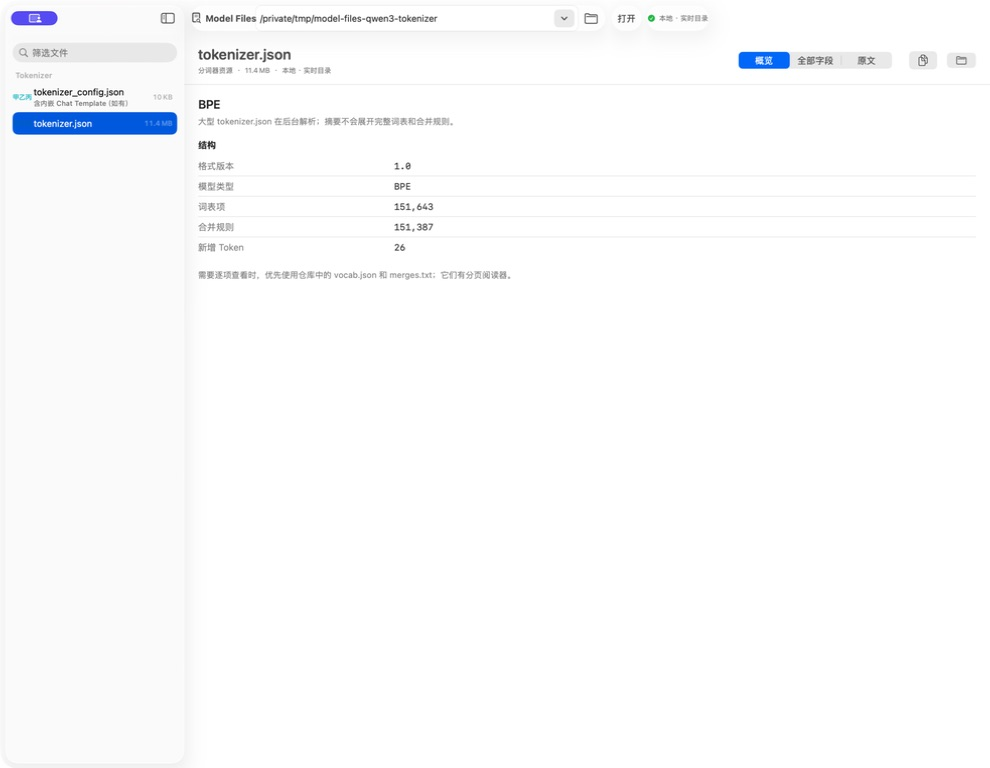
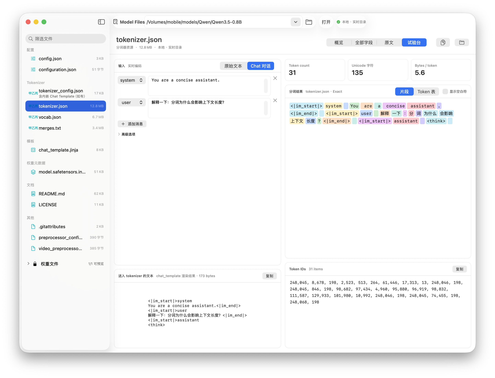

# ModelFiles (Native macOS)

ModelFiles is a native macOS inspector for Hugging Face / ModelScope model artifacts. Open a repository, read the files that describe it, then diagnose tokenizer and chat-template behavior without loading weights or running inference.

## Highlights

- Open a local folder, Hugging Face / ModelScope repository, or SSH directory
- Inspect SafeTensors headers, GGUF metadata prefixes, legacy imatrix files, Jinja templates, Markdown, source files, and PDFs
- Load tokenizer bundles: `tokenizer.json`, SentencePiece `.model`, `tokenizer_config.json`, `chat_template.jinja`
- Visualize vocabulary structure: type, vocab/merge counts, added tokens, length percentiles, a distribution chart, and the longest pieces by Unicode scalar and UTF-8 byte length
- Search `tokenizer.json` vocabulary on demand by ID or piece; the overview keeps only a short special-token summary and the longest 50 tokens
- Tokenize raw text or chat messages, or paste Token IDs and decode them back
- Color-coded segments, Token table, and ID list share one selected token; the table marks special tokens and chat roles
- Render the active Jinja chat template, switch among jinja / config / named sources, and split total / content / template-overhead counts
- Keep Exact vs decoded-only mappings explicit, including byte-fallback cases
- Recover missing `tokenizer_class` with an explicit in-session override; the override is never written back
- Compare two tokenizers on the same input: another file in the current snapshot, or a tokenizer bundle from another repository
- Check repository consistency across `config`, tokenizer, adapter/processor configs, chat templates, and already-opened GGUF metadata
- Stay read-only: no weights, no tensor payloads, no inference

Tokenizer visualization is inspired by [tiktokenizer](https://tiktokenizer.vercel.app/).

## Screenshots

### Vocabulary structure and long-token analysis


The overview turns a large `tokenizer.json` into actionable structure: BPE vocabulary/merge counts, percentile cards, a distribution chart, and the longest tokens with separate character and UTF-8-byte measures.

### Chat template and colored token visualization


Enter source text or chat messages, inspect the authoritative encoded text, then follow its color-coded token segments through to the complete Token ID list.

## Limits

- Readable files and tokenizer bundles: 32 MiB
- Playground / Token ID input: 64 KiB UTF-8
- Vocabulary search and comparison diffs show at most 1,000 matches
- GGUF consistency uses metadata from files already opened in the current session
- SentencePiece `.model` files encode and decode, but have no `tokenizer.json` vocabulary index

## Repository structure

```text
tools/model-files/
├── Sources/ModelFiles/        # SwiftUI app source
├── Tests/ModelFilesTests/     # Unit tests and fixtures
├── docs/                      # Design notes, acceptance, screenshots
├── script/                    # Build/run helper scripts
├── dist/                      # Local build artifact output
└── Package.swift              # SwiftPM package manifest
```

## Requirements

- macOS 15.0+
- Swift 6.0+ toolchain
- Command-line tools: `git`, `swift`

## Build and run

```bash
# from repo root or from tools/model-files
cd tools/model-files

# build and run app
./script/build_and_run.sh run

# generate app bundle only and verify metadata
./script/build_and_run.sh verify
```

## Basic workflow

1. Launch the app.
2. Open a local folder, Hugging Face / ModelScope repository, or SSH directory.
3. Use the header badge for a consistency summary; open Config for the full report.
4. Open `tokenizer.json` or a SentencePiece `.model` to enter the playground.
5. Encode raw text, render chat messages, or paste Token IDs to decode.
6. Optionally compare another tokenizer in the same snapshot, or load a second repository's tokenizer bundle.
7. Open README, code, PDF, GGUF, or imatrix files as needed. Weight files stay locked.

## Test

From `tools/model-files`:

```bash
CLANG_MODULE_CACHE_PATH="$PWD/.build/module-cache" \
SWIFTPM_MODULECACHE_OVERRIDE="$PWD/.build/module-cache" \
swift test --disable-sandbox
```

Real-model tests stay skipped unless `MODELFILES_REAL_TOKENIZER_DIR` or `MODELFILES_REAL_SENTENCEPIECE_DIR` points at a complete same-directory tokenizer bundle.

## Acceptance evidence

- Tokenizer playground: [`docs/tokenizer-playground-acceptance.md`](docs/tokenizer-playground-acceptance.md)
- Diagnostic inspector (token IDs, consistency, comparison): [`docs/diagnostic-inspector-acceptance.md`](docs/diagnostic-inspector-acceptance.md)

## License

This project is licensed under the MIT License. See [`LICENSE`](LICENSE).
