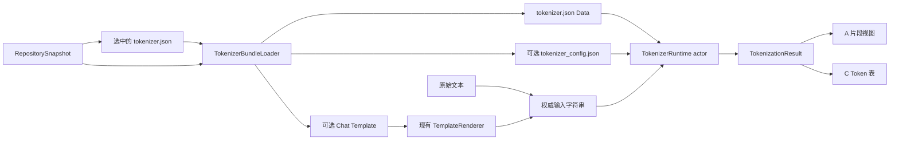

# ModelFiles Tokenizer Playground 实施方案

状态：已实施并验收（未提交）

决策：采用 **A（左右工作台）+ C（诊断表格）** 组合

适用基线：`main` / `f206590`

日期：2026-08-09

实施证据：[Tokenizer Playground 验收记录](tokenizer-playground-acceptance.md)

## 1. 结论

该功能在当前 ModelFiles 架构内可行，但可行性有明确边界：

- 第一版只分析当前仓库快照中的 `tokenizer.json`，不增加全局模型选择器。
- 默认界面采用 A：左侧输入，右侧显示 token 数量、彩色片段和 ID。
- C 不新增顶层“查看方式”，而是作为试验台右侧的“Token 表”子视图；默认子视图仍是“片段”。
- 分词运行时采用 Hugging Face `swift-transformers` 1.3.3 的 `Tokenizers` product，并固定精确版本。
- Chat 模式复用现有 `TemplateRenderer` 和消息、Tools、变量模型。可见的渲染结果是唯一权威输入，再调用 `encode(text:addSpecialTokens:false)`；不维护第二套 Chat Template 语义。
- 支持 Hugging Face、ModelScope、本地目录和 SSH 目录，统一经现有 `RepositoryAccess` 读取同一 `RepositorySnapshot` 中的伴随文件。
- 不承诺原始字节、字符 offset 或任意 tokenizer 的精确原文映射。上游公开 API 没有提供这些信息；UI 必须区分“精确对应原文”和“仅展示解码结果”。
- 不下载模型权重，不执行模型推理，不计算价格或上下文剩余量。

已完成的前置验证：

- 当前工程为 Swift 6、macOS 15，现有依赖为 `swift-jinja` 2.4.1 与 Textual 0.5.0。
- `swift-transformers` 1.3.3 在相同 Swift/macOS 环境中可以构建。
- 上游 Qwen3 重复 emoji + Chat Template 测试通过；离线本地目录 tokenizer 测试通过。
- 当前 ModelFiles 基线测试通过：37/37，0 failure。

## 2. 依据与原型

- [功能拆解与原型问题](tokenizer-playground-prototype.md)
- [A/B/C 可交互原型](prototypes/tokenizer-playground.html)
- 上游实现：[huggingface/swift-transformers 1.3.3](https://github.com/huggingface/swift-transformers/tree/1.3.3)
- 参考产品：[Tiktokenizer](https://tiktokenizer.vercel.app/)

原型中的 B 只保留为对比方案，不进入第一版实施范围。

## 3. 用户可见契约

### 3.1 入口

选中名为 `tokenizer.json` 的文件后，顶层查看方式为：

`概览 / 全部字段 / 原文 / 试验台`

其他普通 JSON 文件保持现状，不出现试验台。`tokenizer_config.json` 现有的 Chat Template 折叠试验台继续保留；本方案不删除其能力。

### 3.2 A：默认工作台

试验台采用左右布局：

- 左侧：`原始文本 / Chat` 模式切换和输入区。
- 右侧：token 总数、当前 tokenizer、状态、`片段 / Token 表` 切换。
- “片段”为默认结果视图：按可安全解码的连续 token 分组着色，并显示各组 ID。
- 文本变化后自动更新；首次加载、编码中、空输入、错误和不支持状态都有独立界面。

### 3.3 Chat 模式

Chat 模式仅在与所选 `tokenizer.json` 同目录的资源中找到可用模板时启用。查找顺序固定为：

1. `chat_template.jinja`；
2. `tokenizer_config.json` 中的 `chat_template` 字符串。

不跨目录猜测模板；根目录 tokenizer 只匹配根目录伴随文件。

Chat 模式复用现有 `TemplateMessage`、`TemplateTool`、`TemplateVariable`、`TemplateRenderRequest` 和 `TemplateRenderer`。处理顺序固定为：

1. 用现有渲染器生成并展示完整字符串；
2. 渲染失败时停止，不执行分词；
3. 将这个完整字符串原样交给 tokenizer；
4. 调用 `encode(text:addSpecialTokens:false)`，避免在模板已经输出特殊 token 后再次添加。

因此，用户看到的渲染结果与被分词的输入必须逐字一致。

### 3.4 C：Token 表

“Token 表”是试验台内部的诊断视图，不增加新的 `InspectionPerspective`。列定义为：

| 列 | 含义 | 权威性 |
|---|---|---|
| `#` | 编码结果中的序号 | 精确 |
| `ID` | tokenizer 返回的 token ID | 精确 |
| `Token Piece` | `convertIdToToken` 返回的词表片段 | 精确；无值时显示占位 |
| `Decoded` | 该 token 所属安全解码分组的显示文本 | 解码结果，不等同原始字节 |
| `Mapping` | `Exact` 或 `Decoded only` | 明确说明能否顺序对应原文 |

第一版不增加 `Bytes`、字符 offset、UTF-8 offset、概率、logit 或 special/normal 列。上游 API 不足以对所有 tokenizer 权威地产生这些数据。

## 4. 范围

### 4.1 第一版包含

- 当前仓库中的 `tokenizer.json` 加载与严格解析。
- BPE、WordPiece、Unigram 等上游 1.3.3 已支持 tokenizer 的编码、解码和 ID/词表片段查看。
- 原始文本输入。
- 使用现有 Jinja 渲染路径的 Chat 输入。
- A 的彩色分组视图。
- C 的诊断表格。
- Hugging Face、ModelScope、本地目录、SSH 目录四种来源。
- latest-only 更新、防抖、输入上限、文件大小上限和错误恢复。
- 深色/浅色、键盘操作、VoiceOver 标签和大结果滚动。

### 4.2 第一版不包含

- OpenAI `cl100k_base`、`o200k_base` 等独立编码器下拉框。
- 跨仓库 tokenizer 比较。
- 修改或保存 tokenizer 配置。
- 自动安装未知 tokenizer 插件或执行仓库自定义代码。
- 模型推理、上下文窗口推断、价格估算。
- 对未知 tokenizer 类型使用非严格模式静默降级。
- 权威原始字节或 offset 映射。
- 将试验台抽象成通用插件框架。

## 5. 技术设计

### 5.1 数据流



### 5.2 伴随文件加载

新增一个具体的 `TokenizerBundleLoader`，职责仅为：

- 校验所选文件名确实是 `tokenizer.json`；
- 在 `snapshot.files` 中按所选文件的父目录精确查找伴随文件；
- 用 `RepositoryAccess.read` 读取数据，继承远端 revision 固定、本地/SSH 快照一致性和路径安全保护；
- 对单文件和 bundle 总量执行显式上限；
- 返回 tokenizer data、可选 tokenizer config data 和可选模板，不做 UI 状态管理。

不调用 `AutoTokenizer.from(pretrained:)`。该 API 会绕过 ModelFiles 的来源抽象，只覆盖 Hugging Face，无法满足 ModelScope、本地和 SSH 的一致行为。

`tokenizer.json` 必须存在。`tokenizer_config.json` 缺失时，先以空配置执行严格构造；只有构造成功才进入可用状态，否则显示缺失或不支持错误，不切换到 `strict:false`。

### 5.3 Tokenizer 运行时

新增一个具体的 `TokenizerRuntime` actor，内部持有上游 `Tokenizer`：

- 用 `JSONDecoder` 将读取到的 JSON 解码为上游 `Config`；
- 调用 `AutoTokenizer.from(tokenizerConfig:tokenizerData:strict:true)`；
- 对输入调用 `encode(text:addSpecialTokens:false)`；
- 批量调用 `convertIdsToTokens`；
- 生成 `TokenizationResult`。

actor 用于隔离 tokenizer 实例并避免主线程执行同步编码。第一版不引入 tokenizer provider 协议或注册表；当前只有一个生产实现，纯分组算法可以直接作为无状态函数测试。

最小结果模型：

```text
TokenizationResult
├── input                 实际被编码的完整字符串
├── tokenIDs              [Int]
├── tokenPieces           [String?]
├── decodedText           全序列 decode 结果
├── segments              [TokenSegment]
└── sourceMapping         Exact | DecodedOnly

TokenSegment
├── tokenRange            结果数组中的半开区间
├── tokenIDs              该组 ID
└── text                  可安全展示的解码文本
```

不单独保存一份可变的 token 行数组；C 表格从 `TokenizationResult` 按索引派生，避免结果状态重复。

### 5.4 分组与原文映射

不能简单逐 token 解码：一个 Unicode 字符可能由多个 byte-level token 组成。分组算法应：

1. 从左到右累积连续 ID；
2. 对累积组解码；
3. 只有当结果形成可稳定展示的字符片段时才结束当前组；
4. 保证所有 ID 恰好出现一次且顺序不变；
5. 最终以全序列 `decode` 结果作为校验基准。

如果分组文本可以按顺序、逐字覆盖输入，标记 `Exact`。只要 tokenizer normalization、cleanup 或特殊 token 使结果与输入不同，就整体标记 `Decoded only`，UI 不显示虚构的原文范围。

必须覆盖：ASCII、中文、组合字符、ZWJ emoji、重复 emoji、换行、连续空格、前导空格、byte fallback、未知 token 和 normalization 差异。

### 5.5 异步状态与取消

上游同步 `encode` 不能在执行中被 Swift Task 强制中断，因此采用有界的 latest-only 模型：

- 输入变化防抖 200–250 ms；
- 每次请求带单调递增 generation；
- 新请求取消旧 Task，但结果提交仍检查 generation；
- 旧编码即使完成，也不能覆盖新输入结果；
- 切换文件或仓库时清空 runtime、结果和错误；
- tokenizer 加载按 `snapshot.version + file.path + contentHash/revision` 缓存，最多保留当前会话；
- 编码和解析不在 `MainActor` 上运行；
- 空输入立即返回 0 token，不启动后台工作。

安全阈值在任务 T0 中用真实语料定标。在定标完成前，默认保持 tokenizer bundle 32 MiB 上限、输入 64 KiB UTF-8 上限；不得为了兼容个别仓库直接移除上限。

### 5.6 UI 复用边界

- `InspectionPerspective.playground` 已存在，直接复用。
- 只对 `tokenizer.json` 将 `.playground` 加入可用视图，不新增 `tokenizerPlayground` 枚举值。
- 从 `TemplatePlaygroundView` 提取可复用的消息/Tools/变量编辑区视图；继续使用原有数据类型和渲染器。
- A 与 C 共享一个 `TokenizationResult`，不得分别触发编码。
- 彩色片段与表格行共享稳定的 token index/range 选择状态；不再创建第二个结果模型。

## 6. 分阶段任务

每个任务限制在一个实现会话内；完成每个检查点后再进入下一阶段。

### T0 — 固定依赖并建立兼容性门槛（M）

依赖：无。

工作：

- 在 `Package.swift` 增加 `swift-transformers` 1.3.3 精确依赖和 `Tokenizers` product。
- 审核 `Package.resolved` 全部变化；若 SwiftPM 推动现有 Jinja 版本，只接受依赖统一所必需的变化，并完整回归模板测试。
- 增加紧凑的离线 tokenizer fixture，至少覆盖 BPE、WordPiece、Unigram/byte fallback 三类，不提交模型权重或大体积 Hub 缓存。
- 增加构造、encode/decode、emoji 和中文 smoke tests。
- 用 Qwen3、GPT-2、BERT 中文、T5/XLM-R 中至少四个真实 tokenizer 做一次非 CI 兼容性验证并记录结果。
- 测量 8 KiB、64 KiB、256 KiB 输入和实际 tokenizer bundle 大小，据此确认或收紧阈值；任何放宽都必须写入验收记录。

可能修改：

- `tools/model-files/Package.swift`
- `tools/model-files/Package.resolved`
- `tools/model-files/Tests/ModelFilesTests/Fixtures/Tokenizers/*`
- `tools/model-files/Tests/ModelFilesTests/TokenizerCompatibilityTests.swift`

验收：

- Swift 6 构建通过。
- 所有测试离线可运行；标准测试不依赖网络和用户缓存。
- 三类小 fixture 均给出固定 ID 与 decode 结果。
- 真实语料兼容性表明确记录 PASS、UNSUPPORTED 或失败原因，不把未知类型标成成功。
- 最终阈值及其测量依据被记录。

验证：

```bash
swift test --package-path tools/model-files --disable-sandbox \
  --filter TokenizerCompatibilityTests
swift test --package-path tools/model-files --disable-sandbox \
  --filter TemplateRendererTests
```

### T1 — 从 RepositorySnapshot 加载 Tokenizer Bundle（M）

依赖：T0。

工作：

- 实现同目录伴随文件查找和 bundle 读取。
- 复用 `RepositoryAccess`，不为四种来源各写一套 tokenizer 下载器。
- 增加取消、文件缺失、未知大小、单文件超限、总量超限、文件变化和错误透传测试。
- 确保加载 tokenizer 不读取任何权重文件。

可能修改：

- `tools/model-files/Sources/ModelFiles/Services/RepositoryService.swift`
- `tools/model-files/Sources/ModelFiles/Services/TokenizerBundleLoader.swift`
- `tools/model-files/Tests/ModelFilesTests/TokenizerBundleLoaderTests.swift`
- `tools/model-files/Tests/ModelFilesTests/RepositoryAccessTests.swift`

验收：

- 四种来源共享同一 loader 行为。
- `subdir/tokenizer.json` 只匹配 `subdir/` 下的配置与模板。
- 远端读取沿用文件 revision；本地/SSH 文件变化仍被现有访问层拒绝。
- 测试 spy 证明没有读取 `.safetensors`、`.gguf` 等权重。

#### 检查点 1：依赖与数据入口

- 全量测试通过。
- `git diff --check` 通过。
- 审核依赖图、fixture 体积和所有网络入口。
- 未进入 UI 前，已经能够从 fake `RepositoryAccess` 严格构造 tokenizer。

### T2 — 生成可验证的 TokenizationResult（M）

依赖：T1。

工作：

- 实现 `TokenizerRuntime` actor、`TokenizationResult` 和 `TokenSegment`。
- 严格构造上游 tokenizer，执行 encode、decode 和 ID/token piece 转换。
- 实现 Unicode 安全分组和 `Exact / Decoded only` 判定。
- 对 tokenizer 类型不支持、JSON 无效、ID 转换缺失给出可操作错误。

可能修改：

- `tools/model-files/Sources/ModelFiles/Models/TokenizerModels.swift`
- `tools/model-files/Sources/ModelFiles/Support/TokenizerRuntime.swift`
- `tools/model-files/Tests/ModelFilesTests/TokenizerRuntimeTests.swift`
- `tools/model-files/Tests/ModelFilesTests/TokenSegmenterTests.swift`

验收：

- `tokenIDs.count == tokenPieces.count`。
- 所有 segment 的 tokenRange 连续、无重叠、无遗漏，覆盖全部 ID。
- 精确映射样例能重建输入；normalization 样例明确为 `Decoded only`。
- 重复 emoji、ZWJ emoji 和 byte fallback 不产生丢 token 或伪 offset。
- 严格模式失败时不回退到近似 tokenizer。

### T3 — 接入 Store 的 latest-only 状态机（M）

依赖：T2。

工作：

- 在 `ModelFilesStore` 增加 tokenizer session、输入结果和 load/run/error 状态。
- 将加载 identity 绑定到 snapshot 版本、文件路径与 hash/revision。
- 实现防抖、generation gate、切换文件清理、空输入快路径和输入上限。
- 把可测试的状态转换从 SwiftUI View 中移出，但不新增通用状态机框架。

可能修改：

- `tools/model-files/Sources/ModelFiles/Stores/ModelFilesStore.swift`
- `tools/model-files/Sources/ModelFiles/Models/TokenizerModels.swift`
- `tools/model-files/Tests/ModelFilesTests/ModelFilesStoreTokenizerTests.swift`

验收：

- 连续快速输入只提交最后一次结果。
- 切换文件、切换仓库、加载失败、编码失败都不会显示旧结果。
- spy/线程断言证明 tokenizer 构造与编码不在主线程执行。
- 超限输入不启动编码，并显示明确的大小与上限。

#### 检查点 2：无 UI 的完整链路

- fake repository → bundle → runtime → latest-only result 的集成测试通过。
- 全量离线测试通过。
- 对真实 Qwen3 tokenizer 重放中文、空白和重复 emoji 样例，结果与已记录 gold 一致。

### T4 — 实现 A 的原始文本垂直切片（M）

依赖：T3。

工作：

- 只对 `tokenizer.json` 开放顶层“试验台”。
- 实现左右工作台、原始文本输入、token 计数、状态和“片段”结果。
- 使用 `LazyVStack`/等价惰性容器显示大结果，颜色按 segment 稳定循环。
- 增加复制输入、复制 ID、清空输入；复制内容必须与屏幕语义一致。
- 空白和换行使用可辨识但不篡改数据的显示方式。

可能修改：

- `tools/model-files/Sources/ModelFiles/Models/InspectionDocument.swift`
- `tools/model-files/Sources/ModelFiles/Stores/ModelFilesStore.swift`
- `tools/model-files/Sources/ModelFiles/Views/DetailView.swift`
- `tools/model-files/Sources/ModelFiles/Views/TokenizerPlaygroundView.swift`
- `tools/model-files/Tests/ModelFilesTests/TokenizerPlaygroundStateTests.swift`

验收：

- 普通 JSON 的视图列表完全不变。
- tokenizer 首次加载、处理中、空输入、成功、不支持、超限、网络/文件错误均可区分。
- A 视图在 900×600 最小可用窗口不遮挡主要操作。
- 键盘可到达模式切换、输入、结果切换和复制按钮。

### T5 — 复用现有 Chat Template 输入（M）

依赖：T4。

工作：

- 从现有 `TemplatePlaygroundView` 提取消息、Tools、变量、generation prompt 编辑区以供两个试验台复用。
- 在 tokenizer 试验台增加 Raw/Chat 切换；无模板时保留 Raw 并解释 Chat 不可用原因。
- 展示完整渲染结果；只有渲染成功才提交同一字符串给 runtime。
- 保留现有 `tokenizer_config.json` 和 `.jinja` 试验台行为。

可能修改：

- `tools/model-files/Sources/ModelFiles/Views/TemplatePlaygroundView.swift`
- `tools/model-files/Sources/ModelFiles/Views/TokenizerPlaygroundView.swift`
- `tools/model-files/Sources/ModelFiles/Support/TemplateRenderer.swift`（仅在复用需要时）
- `tools/model-files/Tests/ModelFilesTests/TemplateRendererTests.swift`
- `tools/model-files/Tests/ModelFilesTests/TokenizerChatPipelineTests.swift`

验收：

- 既有 Template Playground 测试和交互不回退。
- Chat 预览字符串与 `TokenizationResult.input` 完全相等。
- Chat 路径始终使用 `addSpecialTokens:false`，有测试防止 BOS/EOS 重复添加。
- 模板错误时旧 token 结果被清除，错误定位在渲染阶段。

#### 检查点 3：A 工作台完成

- Raw 与 Chat 两条用户路径均在真实 app 中走通。
- 对 Hugging Face、本地目录至少各完成一次：选择 tokenizer → 输入 → 查看片段 → 切换文件 → 切回。
- 深色和浅色截图确认文字、分组颜色、选中态和错误态可读。
- VoiceOver/Accessibility Inspector 能读出输入模式、token 数量和主要操作。

### T6 — 实现 C 诊断表格（M）

依赖：T5。

工作：

- 在右侧结果区增加“片段 / Token 表”切换。
- 实现 `# / ID / Token Piece / Decoded / Mapping` 五列及排序稳定的惰性表格。
- 片段选择与表格行选择使用相同 token index/range；切换视图不重新编码。
- 为长 token piece、控制字符、空白和缺失 piece 提供可复制的明确显示。

可能修改：

- `tools/model-files/Sources/ModelFiles/Views/TokenizerPlaygroundView.swift`
- `tools/model-files/Sources/ModelFiles/Views/TokenizerTokenTableView.swift`
- `tools/model-files/Tests/ModelFilesTests/TokenizerPlaygroundStateTests.swift`

验收：

- 表格行数等于 token 数。
- 每行 ID 和 piece 与 runtime 结果一致。
- A/C 切换不会增加 encode 调用次数。
- `Decoded only` 不显示任何伪造的 offset 或原文范围。
- 10k token 结果仍可滚动和选择，不一次性创建 10k 个复杂子视图。

### T7 — 性能、安全、可访问性与验收收口（M）

依赖：T6。

工作：

- 完成四来源矩阵、真实 tokenizer 矩阵、Unicode/Chat/错误矩阵。
- 对 tokenizer load、encode 和结果构造分别计时，避免把网络时间误算为编码性能。
- 验证 generation gate、输入上限、bundle 上限和内存峰值。
- 验证深/浅色、缩放、VoiceOver、键盘和最小窗口。
- 增加第三方依赖说明，并把最终证据写入 `docs/tokenizer-playground-acceptance.md`。
- 更新本计划状态与偏差；所有文档继续位于 `tools/model-files/docs/`。

可能修改：

- `tools/model-files/docs/tokenizer-playground-acceptance.md`
- `tools/model-files/docs/tokenizer-playground-implementation-plan.md`
- `tools/model-files/docs/third-party-dependencies.md`
- 相关测试文件与必要的 UI 文件

验收：

- 全量测试、bundle 构建验证、格式检查全部通过。
- 无任何模型权重请求；使用访问层 spy 和一次真实网络日志双重证明。
- 输入或选择变化后，旧结果永远不能回写。
- 未支持 tokenizer 显示明确错误和文件/类型信息，不崩溃、不静默近似。
- 验收记录包含环境、commit、来源、模型、样例、计时口径、PASS/FAIL/BLOCKED 和截图路径。

#### 最终检查点：Definition of Done

- A 是默认试验台，C 是同一结果的诊断视图。
- Raw 和 Chat 都使用当前仓库的 tokenizer，Chat 可见输出等于实际编码输入。
- Hugging Face、ModelScope、本地、SSH 不存在分叉实现。
- 精确与非精确映射在 UI 和数据模型中都不混淆。
- 现有 37 个测试及所有新增测试通过；现有配置、Jinja、GGUF、SafeTensors、Imatrix 行为不回退。
- 所有新增和既有 ModelFiles 文档均在 `tools/model-files/docs/`。

## 7. 验证矩阵

### 7.1 来源

| 来源 | Bundle 加载 | Raw | Chat | 切换后旧结果隔离 |
|---|---:|---:|---:|---:|
| Hugging Face | 必测 | 必测 | 有模板必测 | 必测 |
| ModelScope | 必测 | 必测 | 有模板必测 | 必测 |
| 本地目录 | 必测 | 必测 | 有模板必测 | 必测 |
| SSH 目录 | 必测 | 必测 | 有模板必测 | 必测 |

### 7.2 内容

| 样例 | 预期 |
|---|---|
| `hello world` | 固定 ID；Exact |
| 中文与中英混排 | 无丢字；映射状态正确 |
| 连续空格、Tab、换行 | 输入不被 UI 修改 |
| 重复 emoji、ZWJ emoji | ID 全覆盖；分组可读 |
| 组合字符与 normalization | 不虚构 Exact |
| Chat + generation prompt | 预览等于编码输入；不重复加特殊 token |
| 无 tokenizer config | 能严格构造则可用，否则明确失败 |
| 未支持 model/pretokenizer | UNSUPPORTED，不降级 |
| 超限文件/输入 | 读取或编码前拒绝 |

### 7.3 标准命令

在本机缓存不可写时使用仓库内 module cache：

```bash
CLANG_MODULE_CACHE_PATH="$PWD/tools/model-files/.build/module-cache" \
SWIFTPM_MODULECACHE_OVERRIDE="$PWD/tools/model-files/.build/module-cache" \
swift test --package-path tools/model-files --disable-sandbox

CLANG_MODULE_CACHE_PATH="$PWD/tools/model-files/.build/module-cache" \
SWIFTPM_MODULECACHE_OVERRIDE="$PWD/tools/model-files/.build/module-cache" \
bash tools/model-files/script/build_and_run.sh verify

git diff --check
```

真实 app 验收使用 `bash tools/model-files/script/build_and_run.sh run`，但不得用源码检查代替实际入口、窗口布局、切换状态和可访问性验证。

## 8. 风险与控制

| 风险 | 级别 | 控制 |
|---|---|---|
| 上游未覆盖某些 tokenizer 组件 | 高 | 精确固定 1.3.3；严格模式；真实兼容矩阵；明确 UNSUPPORTED |
| 依赖体积和冷构建时间增加 | 中 | T0 记录依赖图、冷构建时间和 bundle 增量；不引入第二套 tokenizer 库 |
| normalization 破坏原文对齐 | 高 | `Exact / Decoded only`；不显示 offset/bytes |
| 同步 encode 无法中途取消 | 中 | 输入上限、防抖、generation gate、后台 actor、旧结果丢弃 |
| tokenizer.json 超过现有 32 MiB | 中 | 真实 corpus 定标；按证据调整；永不无上限读取 |
| Chat 渲染与分词输入分叉 | 高 | 唯一权威字符串；`addSpecialTokens:false`；等值测试 |
| 子目录伴随文件误配 | 中 | 只按所选 tokenizer 父目录匹配，不跨目录猜测 |
| A/C 各自维护结果造成漂移 | 中 | 单一 `TokenizationResult`；C 为派生视图；编码次数测试 |

## 9. 实施约束

- 遵循 YAGNI：只增加有当前职责的 loader、runtime、结果值类型和视图；不增加 provider 注册表、插件系统或通用分析框架。
- 保护现有来源安全边界和权重阻断逻辑。
- 不顺手重构无关 Reader、GGUF、SafeTensors 或导航代码。
- 每个检查点保留测试和真实行为证据；未复现或未验证的来源标为 BLOCKED，不写成 PASS。
- 本方案不预授权 commit；实施时是否分阶段提交由用户另行决定。

## 10. 实施结果

T0–T7 已于 2026-08-09 完成，最终结果见[验收记录](tokenizer-playground-acceptance.md)：

- 全量离线测试发现 57 项：56 项执行通过，1 项显式非 CI benchmark 跳过；bundle verify 与 `git diff --check` 通过。
- A 工作台、Qwen3 Chat、C Token 表、本地无模板回退、深浅色和 AX 入口均通过真实 App 验收。
- Qwen3 真实 8/64/256 KiB 性能定标后，保留 32 MiB bundle 与 64 KiB UI 输入上限。
- 所有 ModelFiles 文档均位于 `tools/model-files/docs/`；没有提交模型权重或 Hub 缓存。
- 兼容性没有被包装成全支持：缺少 `tokenizer_class` 的旧仓库和当前 Jinja 不支持的模板会给出明确错误，详情与来源矩阵记录在验收文档。
- 未执行 commit；本方案没有授予提交权限。
