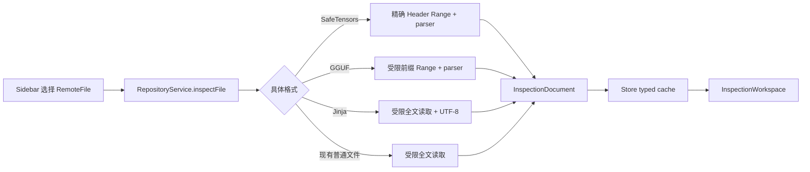
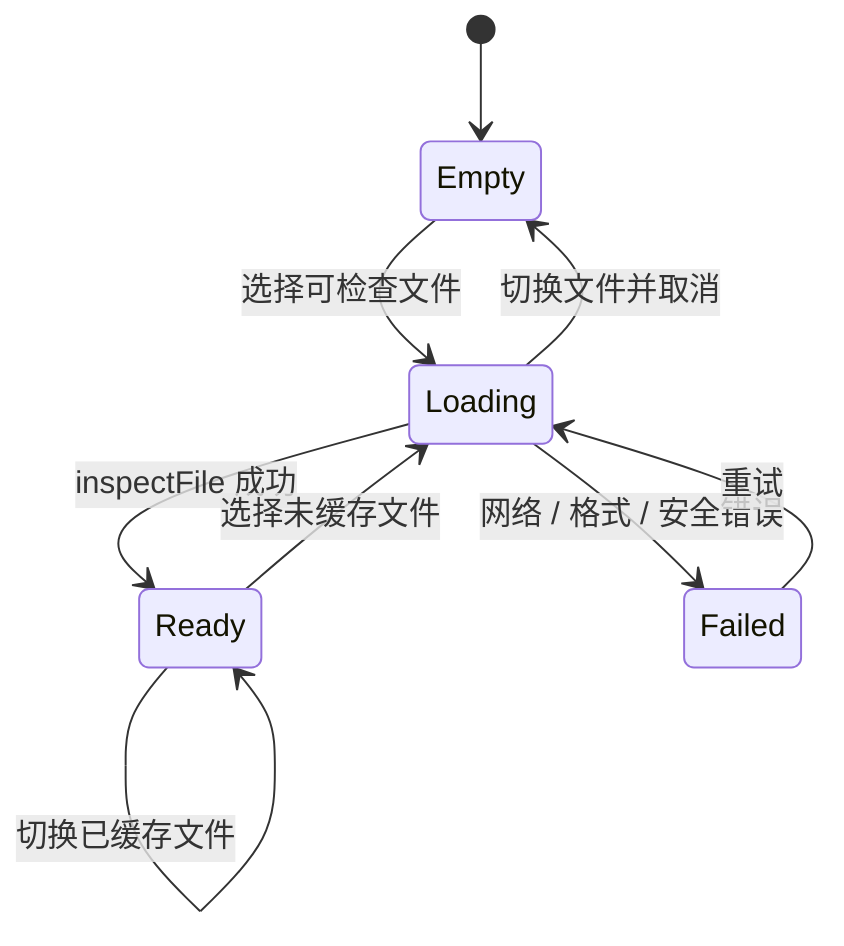

# ModelFiles 格式检查架构与交互设计

状态：已确认设计
日期：2026-07-21
视觉方向：方案 3（主内容画布 + 右侧上下文检查器）

## 决定

ModelFiles 将 SafeTensors、GGUF、Jinja 统一为同一种“文件检查”工作流，但保留各格式自己的强类型内容与操作。

- 统一的是加载入口、缓存结果、页面状态、视图骨架、搜索与选择交互。
- 不统一成一张万能 metadata 表；tensor、GGUF KV、Jinja 源码和渲染输入仍是不同领域对象。
- 详情页采用同一套工作台：文件身份区、格式语义标签、主内容画布、可选的右侧上下文检查器。
- `RepositoryService` 提供一个深层 Interface：输入远程文件，返回可直接展示的 `InspectionDocument`。格式识别、Range 策略、安全限制和解析都藏在该 Module 内。
- 首版使用具体 enum 和 switch，不增加 protocol、registry、factory、动态插件或第三方依赖。

这份设计替代“继续复用固定摘要 / 全部字段 / 原文三段式详情页”的旧提案。固定三段式不能表达 Jinja 的编辑与运行，也不能表达 tensor 表格的选择上下文。

## 为什么需要调整现有架构

当前同一个格式决定分散在三个位置：

1. `RemoteFile.supportsMetadataPreview` 决定文件能否打开。
2. `RepositoryService.loadFile` 决定如何读取数据。
3. `DetailView` 再按扩展名解析 `Data` 并选择视图。

`ModelFilesStore` 只缓存无类型的 `Data`，导致 View 同时承担格式判断、解析和展示。新增 GGUF 后，如果继续沿用这个结构，同一个 switch 会出现在文件模型、网络服务和多个 View 中；Jinja 又会成为详情页里的特殊分支。

目标不是建立通用文件插件系统，而是把已经存在的三种真实格式收束到一个稳定 Seam：



## 目标与非目标

### 目标

1. SafeTensors、GGUF、Jinja 通过同一个加载与页面状态模型打开。
2. 每种格式保留最适合它的主视图和操作。
3. metadata 展示明确区分文件内嵌、应用推导、仓库信息和运行结果，避免把推导值伪装成文件字段。
4. 二进制格式只读取展示所需的最少字节；不可信输入有确定的上限与错误。
5. 当前 JSON、Markdown、文本等读取能力不回退。

### 非目标

- 运行或转换模型、读取 tensor 数据、反量化或验证权重内容。
- 为未来格式建立插件 SDK。
- 把所有格式映射为相同字段集合。
- 为 Jinja 自造不可靠的 AST、变量依赖或宏分析器。
- 自动聚合多个 GGUF / SafeTensors shard。
- 在主进程反序列化 PyTorch checkpoint。

## 支持范围

| 格式 | 首版能力 | 读取策略 | 主要视图 |
| --- | --- | --- | --- |
| SafeTensors | header metadata、tensor、dtype、shape、参数数、数据字节数 | 8-byte 长度 + 精确 Header Range | 概览 / Metadata / Tensors |
| GGUF v1-v3 | 标准 KV、版本、字节序、架构、量化、tensor 目录、shape、参数数 | 1 MiB 分块前缀，最多 32 MiB | 概览 / Metadata / Tensors |
| Jinja chat template | 源码、基本来源信息、编辑、输入配置、渲染与结果检查 | UTF-8 全文，沿用 32 MiB 上限 | 概览 / 源码 / 试验台 |
| JSON、Markdown、普通文本 | 保持现有展示 | 受限全文 | 沿用现有阅读模式，后续按需迁移 |
| PyTorch、ONNX 等权重 | 仍锁定 | 不读取 | 文件身份与安全说明 |

## 领域模型

### 对外 Interface

`RepositoryService` 从返回裸 `Data` 深化为返回已检查的文档：

```swift
extension RepositoryService {
    func inspectFile(
        _ file: RemoteFile,
        from snapshot: RepositorySnapshot
    ) async throws -> InspectionDocument
}
```

调用方不需要知道 SafeTensors 是两次精确 Range、GGUF 是逐段补读，还是 Jinja 是完整 UTF-8 文本。这个方法是加载、取消、错误和缓存测试的主 Interface。

不为解析器定义公开 protocol。当前只有一个调用方和三个已知格式，具体 switch 更容易追踪，也避免为了“可扩展”暴露尚未稳定的内部端口。

### 强类型文档，而不是万能字典

建议用一个带关联值的 enum 表示结果：

```swift
enum InspectionDocument {
    case safetensors(SafetensorsOverview)
    case gguf(GGUFOverview)
    case jinja(JinjaDocument)
    case generic(Data)
}
```

`generic(Data)` 是迁移期间保留现有 JSON、Markdown 和文本能力的 Adapter，不是新格式扩展点。等这些现有阅读器确实需要类型化时再逐个替换，不在本次设计里顺带重写。

`InspectionDocument` 通过 computed properties 提供页面真正共享的少量信息：

```swift
extension InspectionDocument {
    var perspectives: [InspectionPerspective] { ... }
    var overviewFacts: [InspectionField] { ... }
    var safetyNotice: String? { ... }
}
```

格式分派只需要一个具体的 `StructuredInspectionFormat` enum：`safetensors`、`gguf`、`jinja`。它供 `RemoteFile` 判断可检查性并供 Service 分派；普通文件继续走 generic 路径。这里不再同时保留 `supportsMetadataPreview`、扩展名 switch 和 View 内判断三套事实来源。

共享类型只保留两类已经跨格式重复出现的数据：

- `InspectionField`：`key`、展示值、值类型和来源；它只是概览和表格使用的展示记录，不取代格式自己的存储模型。
- `TensorDescriptor`：`name`、`dtype`、`shape`、参数数、可选字节数和格式特有详情。

其中 `InspectionField.Origin` 只有四个值：

- `embedded`：文件真实编码的字段。
- `derived`：应用从文件内容计算出的值，如参数总数、行数。
- `repository`：文件大小、revision、source 等仓库信息。
- `runtime`：Jinja 当前一次渲染产生的状态和结果。

来源是 UX 必需信息，不是为了抽象而抽象。它防止“模板有 84 行”或“渲染成功”被误认为 Jinja 文件自带 metadata。

### 格式特有内容

SafeTensors：

- 复用并收紧现有 `SafetensorsOverview`。
- `SafetensorInfo` 可迁移为共享的 `TensorDescriptor`，避免 SafeTensors 和 GGUF 各自维护一套 tensor 表格模型。
- 保留 `__metadata__` 的原始字符串字段。

GGUF：

- `GGUFOverview` 保留 version、endianness、KV、tensorDataOffset、tensors 和汇总值。
- GGUF 的 typed value 与嵌套 array 是 parser 内部和详情展示需要的真实语义，不强行转换成字符串字典。
- 未知 metadata key 保留；未知 tensor type 显示数值，不因此丢弃整份文档。

Jinja：

- `JinjaDocument` 保存原始源码及初始化试验台所需的 tokenizer config。独立 `.jinja` 文件没有配套 config 时使用空值，不自动跨文件猜测关联。
- 现有 `tokenizer_config.json` 内嵌的 `chat_template` 仍可从 tokenizer 摘要进入同一个 Jinja 工作台，并显式携带该 JSON 作为 config；S1 不要求把整个 tokenizer config 变成新的文档类型。
- 模板编辑内容、messages、tools、变量、渲染结果属于 Jinja workspace 的 session state，不写回缓存的文件文档。该状态放在 perspective 内容之上，切换“源码 / 试验台”不会丢失；切换文件或刷新仓库时丢弃。
- 首版只提供可靠的派生事实：字节数、行数、来源、当前渲染状态。没有正式 parser 时不展示“识别到的变量 / macro 数”等猜测性 metadata。

## 加载与安全边界

### SafeTensors

1. 读取最前 8 bytes。
2. 以 little-endian `UInt64` 解析 Header 长度。
3. 校验长度不超过现有 25 MB 上限和仓库文件大小。
4. 精确读取 JSON Header；不读取 tensor 数据区。
5. Range 响应必须为 HTTP `206`，否则终止，不回退到完整下载。

### GGUF

1. 要求文件清单给出大小；缺失时安全失败，首版不增加 HEAD 回退。
2. 从 byte 0 开始按 1 MiB 不重叠 Range 追加读取。
3. 每段完成后尝试继续顺序解析；得到完整 tensor directory 后停止。
4. 最多读取 32 MiB。若最后一段越过 `tensorDataOffset`，缓存只保留解析所需数据。
5. 因 GGUF 没有独立 Header 长度，最后一次请求最多可能带回不足 1 MiB 的首个 tensor 数据；UI 明确披露这一点。
6. 仍要求每段返回 `206`，绝不退回整文件下载。

GGUF parser 只使用 Foundation 和顺序 byte cursor，并设置以下硬限制：

- metadata KV 最多 100,000 项。
- 单次检查累计解析的 metadata array 元素最多 1,000,000 项。
- 单字符串最多 10 MiB。
- tensor 最多 1,000,000 个，单 tensor 最多 8 维。
- array 嵌套最多 4 层。
- 所有 offset、长度、shape 乘法和汇总执行溢出检查。
- 不根据 metadata 中的 URL、文件名或 offset 发起额外请求。

解析器必须区分：需要更多数据、文件无效、超出安全预算。内部使用一个小型结果 enum 即可，不建立通用二进制框架。

### Jinja 与普通文本

- 沿用 32 MiB 全文上限，严格按 UTF-8 解码。
- 渲染继续使用现有本地 `TemplateRenderer`，不发起外部请求，不执行模板中提供的任意代码。
- 原文件不可变；试验台修改只存在于当前 View 生命周期，离开文件后不会误写远端。

## 状态与缓存

`ModelFilesStore` 把 `[String: Data]` 改为 `[String: InspectionDocument]`，并把 `selectedData` 改为 `selectedInspection`。

页面状态保持单向：



具体规则：

- 切换文件取消旧请求，旧请求不能覆盖新选择。
- 新文件默认打开它的第一个 perspective，通常为“概览”。
- 每个文件只缓存解析完成的文档；截断前缀和失败结果不进入缓存。
- Jinja 的临时编辑和运行状态不进入文档缓存。
- 格式解析错误显示在当前文件工作台内，不复用“无法打开仓库”的全局错误。

## 交互与 UI

### 统一的是工作台，不是内容

已确认采用方案 3 的布局原则：主内容画布承担当前任务，右侧检查器解释当前选择或提供运行上下文。

```text
┌ Repository ──────┬──────────────── File identity ─────────────────────┐
│ files             │ name · format · size · source · revision · actions│
│                   ├──────── semantic perspectives ─────────────────────┤
│ model.gguf        │ 概览   Metadata   Tensors                          │
│ model.safetensors ├───────────────────────────────┬────────────────────┤
│ chat_template...  │                               │ Context inspector  │
│                   │ Main content canvas           │ selected item /    │
│                   │                               │ inputs / result    │
│                   ├───────────────────────────────┴────────────────────┤
│                   │ format-specific safety notice                      │
└───────────────────┴────────────────────────────────────────────────────┘
```

一致性来自以下交互合同：

1. 顶部永远回答“正在检查哪个文件、来自哪里”。
2. 中部标签使用格式语义，不再固定为摘要 / 字段 / 原文。
3. 主画布展示当前任务的可扫描内容。
4. 选择一行或一个输出项后，右侧检查器展示详细上下文；没有有效上下文时可收起，不保留空白侧栏。
5. 底部安全说明准确描述本次实际读取的范围。

### 文件身份区

保留文件名、用途、大小、源站、branch / revision、复制路径和“在源站打开”。增加一个简短格式 badge，如 `GGUF v3`、`SafeTensors`、`Jinja`。

不在标题区堆放参数总数、tensor 数等内容；这些属于概览，避免标题随格式膨胀。

### 语义标签

标签由 `InspectionDocument.perspectives` 提供：

| 格式 | Perspectives |
| --- | --- |
| SafeTensors | 概览 / Metadata / Tensors |
| GGUF | 概览 / Metadata / Tensors |
| Jinja | 概览 / 源码 / 试验台 |

这会替代固定 `DetailMode.allCases`。`InspectionPerspective` 只包含当前已有视图所需的有限 case，不做字符串驱动的动态页面配置。

### 概览

概览是快速回答“这是什么”的摘要，不是完整字段倾倒：

- 首屏只展示 5–7 个高价值事实。
- SafeTensors：tensor 数、参数数、数据大小、主要 dtype、Header metadata 数。
- GGUF：架构、量化、上下文长度、tensor 数、参数数、版本、已读取前缀。
- Jinja：源码字节数、行数、来源文件、当前是否有未保存的临时修改、最近一次渲染状态。
- 每个事实以来源标记或辅助文案区分 embedded / derived / repository / runtime。

### Metadata

SafeTensors 与 GGUF 共用表格交互，而不是共用数据结构细节：

- 顶部搜索 key 和值；结果计数就地显示。
- 行展示 key、类型、值摘要、来源。
- 长字符串与 array 默认显示摘要；在右侧检查器展开，避免表格被单个值撑开。
- 选择字段后，右侧显示完整值、类型、来源和格式特有说明。
- GGUF 的超大 array 只显示 parser 保留的数量与受限预览，不为了 UI 保留完整词表副本。

### Tensors

SafeTensors 与 GGUF 复用 tensor table 和右侧 tensor inspector：

- 表格列：name、shape、dtype / quantization、parameter count、可用时的 byte count。
- 搜索名称；按 dtype / quantization 过滤；列头排序。
- 单击行在右侧展示完整 shape、参数数、字节数或 offset，以及所属格式的额外字段。
- 不读取 tensor 数据来生成统计或预览。
- 首版不做图表；dtype 分布只有在概览无法快速表达时再增加。

### Jinja 源码与试验台

Jinja 使用同一工作台骨架，但右侧内容随任务变化：

- “源码”：主画布是完整编辑器；右侧只显示可靠的文件事实和渲染诊断。没有可靠 outline 数据时不放空壳 outline。
- “试验台”：主画布保留模板与渲染结果；右侧检查器容纳 messages、tools、variables 和运行选项。选择输出项时，右侧可切换到结构化结果详情。
- 复用现有 debounce、预设、恢复原模板和 `RenderedOutputInspector` 行为。
- 用户编辑的是临时工作副本，标题区明确显示“临时修改”，不暗示会写回仓库。

当前 `TemplatePlaygroundView` 的三层 SplitView 可在迁移时重新组合，但渲染模型和输入组件不重写。

### 空态、加载与错误

- 加载态显示具体动作：`读取 SafeTensors Header`、`读取 GGUF metadata 前缀`、`读取 Jinja 源码`。
- GGUF 分块读取可显示“已读取 X / 32 MiB 安全预算”，不伪造文件总下载进度。
- 格式错误保留在主画布，显示失败阶段和可操作的重试。
- 被锁定的权重文件仍展示身份区与原因；不出现不可用的语义标签。
- 无选中行时，右侧检查器自动收起或显示简短选择提示，不显示大面积空白卡片。

### 键盘与可访问性

- `⌘1`、`⌘2`、`⌘3` 切换当前文件实际存在的 perspective。
- `⌘F` 聚焦当前主画布的搜索；源码模式沿用编辑器查找。
- 表格方向键移动选择，`Space` 或 `Return` 聚焦右侧详情。
- 选中状态、dtype 和错误不能只依赖颜色；使用文字、图标和 VoiceOver label。
- 使用 macOS semantic colors，并支持窗口收窄时自动隐藏右侧检查器。

## 代码边界

### 修改

- `Models/RepositoryModels.swift`
  - 用具体格式识别替换 SafeTensors-only 的 `supportsMetadataPreview` 判断。
  - `DetailMode` 迁移为有限的 `InspectionPerspective`。
- `Services/RepositoryService.swift`
  - 将 `loadFile -> Data` 深化为 `inspectFile -> InspectionDocument`。
  - 内部承载各格式读取策略和安全错误，不公开 loader protocol。
- `Stores/ModelFilesStore.swift`
  - 缓存 typed document；保持现有取消和选择语义。
- `Views/DetailView.swift`
  - 收缩为工作台编排，不再直接解析文件。
- `Views/TemplatePlaygroundView.swift`
  - 适配主画布 + 右侧上下文检查器，复用现有渲染状态和子组件。
- `Support/SafetensorsInspector.swift`
  - 输出统一 tensor descriptor / inspection field 所需字段，并补强无效 entry 的错误反馈。

### 新增

只增加两个有明确职责的生产文件：

- `Models/InspectionDocument.swift`：文档 enum、perspective、共享 metadata / tensor 展示模型。
- `Support/GGUFInspector.swift`：GGUF 顺序解析与安全上限。

UI 不拆成一组“一格式一 View”文件作为首要目标。先在现有 `DetailView` / `TemplatePlaygroundView` 中形成清楚的私有子视图；只有单文件规模或独立测试确实需要时再拆分。

测试预计新增 `GGUFInspectorTests.swift`，并扩展现有 service、SafeTensors 和分类测试。不新增通用 parser 测试框架。

## 测试策略

### Interface 级测试

以 `RepositoryService.inspectFile` 为主测试面，使用受控 HTTP 响应验证：

1. SafeTensors 只请求 8 bytes 和精确 Header，返回 typed document。
2. GGUF 请求不重叠、每段不超过 1 MiB、累计不超过 32 MiB，完成后停止。
3. 两种 Range 路径遇到非 `206` 立即失败，不触发完整下载。
4. Jinja 在限制内读取全文，非法 UTF-8 和超限返回格式化错误。
5. 选择切换取消旧任务，旧结果不能进入当前文档。

### Parser 级测试

- SafeTensors：无效根对象、无效 shape / offset、溢出和 metadata。
- GGUF：v1-v3、大小端、scalar、string、array、未知 key / tensor type、截断、超限和溢出。
- Jinja：继续覆盖现有 renderer、preset、tools、variables 与错误诊断；不增加没有 parser 支撑的语义测试。

### UI 与人工验收

自动测试不能代替以下真实界面检查：

- 三种格式切换后 perspective、主画布和右侧检查器内容正确更新。
- 窗口缩窄、暗色模式、长 key、长 tensor name、长 Jinja 模板下布局可用。
- 键盘连续搜索、表格选择、焦点进入 / 返回右侧检查器正常。
- Jinja 连续输入不会丢字符，切换 perspective 后临时编辑状态符合设计。
- Hugging Face 与 ModelScope 各检查一个 GGUF；核对字段、请求范围和安全说明。
- 选择 shard 只读取当前文件，不暗示已得到全模型汇总。

实现完成后的基础命令：

```bash
swift test --package-path tools/model-files
./tools/model-files/script/build_and_run.sh verify
```

## 实施切片

### S1：收束模型与加载边界

- 引入 `InspectionDocument` 和动态 perspectives。
- `RepositoryService.inspectFile` 返回 typed document。
- Store 缓存 typed document。
- 先适配现有 SafeTensors、Jinja 与 generic 路径，行为保持不变。

验收：三种结构化格式的判断与解析不再出现在 View；现有测试和真实 SafeTensors / Jinja 流程通过。

### S2：工作台 UI

- 将详情页改为文件身份区、语义标签、主内容画布、右侧上下文检查器。
- SafeTensors 使用 tensor / metadata 表格；Jinja 迁移到同一布局。
- 补齐加载、错误、安全说明和键盘交互。

验收：已确认的方案 3 结构在两种不同内容类型上成立，而不是只适合 Jinja。

### S3：GGUF

- 实现受限前缀读取和 GGUF parser。
- 接入概览、Metadata、Tensors，不新增另一套页面骨架。
- 完成 Range、安全上限和真实仓库验收。

验收：GGUF 能在不完整下载权重的前提下提供结构信息；不支持 Range 的源站安全失败。

## 被否决的方案

### 每种格式独立详情页

短期直接，但文件身份、加载、搜索、错误和选择状态会重复，三种格式的使用方式也会漂移。

### 通用 metadata schema

会把 tensor、GGUF typed array 和 Jinja runtime state 降格为字符串 key/value，丢失最重要的语义。共享展示记录只用于表格与来源，不作为所有格式的存储模型。

### parser protocol + registry + factory

目前只有一个应用内调用方和三个已知格式。它增加了发现、注册、错误和依赖注入概念，却没有运行时扩展需求。等出现外部插件或多个独立调用方再评估。

### 保留裸 `Data`，只在 View 中增加 GGUF 分支

实现最少但继续扩大当前问题：加载策略、解析错误和格式选择散落在 Model、Service 与 View，无法形成统一缓存和状态模型。

### GGUF 完整下载或非 Range 回退

与工具“远程、只读、按需检查”的安全承诺冲突。宁可明确失败，也不因源站行为意外下载数 GB 权重。

## 结果与代价

正向结果：

- View 只展示文档，不再拥有二进制解析与网络策略。
- 新增 GGUF 不会复制整个详情页。
- 三种格式在同一工作台中可预测，但各自保留合适的任务界面。
- metadata 的来源可见，减少用户对“文件字段”和“应用推导值”的混淆。

代价：

- `InspectionDocument` 是一个中心 switch；增加真实格式时要修改它和对应 UI 分支。
- 迁移期间 `generic(Data)` 仍保留旧阅读器，统一不是一次性覆盖所有仓库文件。
- 右侧检查器需要在窗口宽度、焦点和选择状态上做真实 AppKit / SwiftUI 验证。

这些代价是有意接受的：中心化的显式 switch 比尚无扩展需求的插件系统更小，也比散落在多个 View 的扩展名判断更容易测试。

## 后续格式的准入条件

只有同时满足以下条件，才扩展 `InspectionDocument`：

1. 有真实仓库样本和明确用户任务。
2. 能提供明显优于文件名、大小和哈希的信息。
3. 有可接受的远程读取预算与不可信输入边界。
4. 能在现有工作台中定义清楚的主 perspective 和上下文检查器。

ONNX、PyTorch checkpoint、SentencePiece 等分别涉及 protobuf、反序列化或 tokenizer 专用语义，应按真实任务单独设计，不预先占位。

## 参考

- [GGUF 官方规范](https://github.com/ggml-org/ggml/blob/master/docs/gguf.md)
- [Hugging Face GGUF 说明](https://huggingface.co/docs/hub/gguf)
- [Hugging Face `@huggingface/gguf` 实现](https://github.com/huggingface/huggingface.js/tree/main/packages/gguf)
- [SafeTensors 格式说明](https://github.com/huggingface/safetensors)
- [PyTorch serialization semantics](https://docs.pytorch.org/docs/main/notes/serialization.html)
- [ONNX external data 规范](https://onnx.ai/onnx/repo-docs/ExternalData.html)
